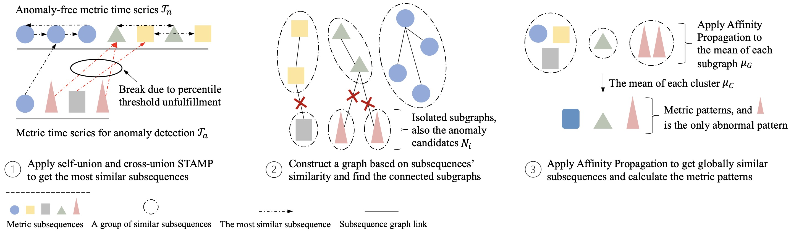

# ADSketch

This repo contains the source code for paper *[Adaptive Time Series Anomaly Detection for Online Services via System Failure Sketching](https://arxiv.org/abs/2201.02944)* (ICSE'22).

**ADSketch (Anomaly Detection via Pattern Sketching)** is an interpretable and adaptive performance anomaly detection algorithm for online service systems. Its core idea is to locate metric subsequences that significantly deviate from those shown in the history. ADSketch achieves interpretability by identifying groups of anomalous metric patterns, which represent particular types of performance issues. The underlying issues can then be immediately recognized if similar patterns emerge again. Figure 1 illustrates the algorithm. Moreover, an adaptive learning algorithm is designed to embrace unprecedented patterns.

## Prerequisites
- Python version 3.6
- All required packages are installed (by command `pip install -r requirements.txt`)
- Windows, Linux or macOS system

## Usage
To use the model, unzip the data, change directory to this project code, execute the command:

- `python yahoo_demo.py` (for Yahoo dataset)
- `python aiops18_demo.py` (for AIOps18 dataset)
- `python industry_demo.py` (for Industry dataset)

## Project Structure
1. `adsketch/motif_operations.py` contains the core functions of ADSketch
2. `./data` contains the datasets used in the paper
3. `params.json` contains the parameter settings for different datasets
4.  `yahoo_demo.py`, `aiops18_demo.py`, and `industry_demo.py` are the scripts to run experiments with different datasets
